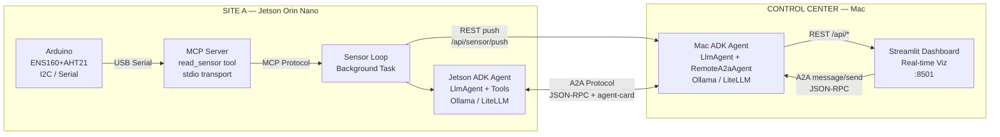

# Agent Edge

**Multi-site edge intelligence system where two autonomous AI agents collaborate in real time — no cloud required.**

Agent Edge is a working demonstration built for [Capgemini's AI Futures Lab](https://www.capgemini.com/about-us/who-we-are/innovation-ecosystem/aifutures/) showcasing how edge AI agents can perceive, reason, and collaborate using open protocols. A Jetson Orin Nano reads environmental sensors, detects anomalies, and coordinates with a Mac to reach decisions — all running local LLM inference with [Liquid AI's LFM 2.5](https://www.liquid.ai/models).

## What This Demonstrates

- **Agents as the new APIs** — autonomous agents replacing rigid service-to-service integrations
- **Google ADK** — Agent Development Kit for building and serving AI agents
- **A2A Protocol** — Google's Agent-to-Agent protocol for cross-device agent collaboration
- **MCP Protocol** — Anthropic's Model Context Protocol for agent-to-system integration
- **On-device intelligence** — Liquid AI LFM2.5-Instruct running locally on edge hardware
- **Visible reasoning** — watch two AI agents think and collaborate in real time on a live dashboard

## Architecture



## Sensor Data

The ENS160+AHT21 module provides five environmental parameters over I2C:

| Parameter | Unit | Anomaly Threshold |
|-----------|------|-------------------|
| Temperature | °C | > 5°C delta from previous |
| Humidity | % RH | — |
| eCO2 | ppm | > 1000 (poor air quality) |
| TVOC | ppb | > 500 (elevated VOCs) |
| AQI | 1–5 | >= 4 (unhealthy) |

When any threshold is exceeded, both agents run LFM analysis and collaborate to reach a decision.

## Project Structure

```
agent-edge/
├── arduino/sensor_reader/       # Arduino .ino for ENS160+AHT21
├── mcp_servers/arduino/         # MCP server exposing read_sensor tool
├── shared/
│   ├── state.py                 # Module-level shared state (per-process)
│   ├── storage.py               # JSON Lines append-only storage
│   └── a2a_setup.py             # Shared A2A route setup for ADK agents
├── agents/
│   ├── jetson/                  # Site A: sensor reading + anomaly detection
│   │   ├── agent_def.py         # ADK LlmAgent definition + tools
│   │   ├── server.py            # Hybrid server: to_a2a() + FastAPI on :8080
│   │   ├── sensor_loop.py       # Background task: MCP read → push to Mac
│   │   ├── tools.py             # detect_anomalies, get_latest_reading, get_sensor_history
│   │   ├── dashboard_routes.py  # REST APIRouter for /api/sensor/current
│   │   ├── cli_chat.py          # Interactive CLI chat (requires agent running)
│   │   ├── config.py            # Thresholds and environment config
│   │   └── mcp_client.py        # MCP client for Arduino server
│   └── macmini/                 # Control: historical analysis + dashboard
│       ├── agent_def.py         # ADK LlmAgent + RemoteA2aAgent(jetson)
│       ├── server.py            # Hybrid server: to_a2a() + FastAPI on :8081
│       ├── tools.py             # compute_statistics, get_history, anomaly_summary
│       ├── dashboard_routes.py  # REST APIRouter for /api/history, /api/chat, etc.
│       └── config.py            # Environment config
├── dashboard/                   # Streamlit real-time dashboard
│   ├── app.py                   # Main app with auto-refresh
│   ├── a2a_client.py            # Sync A2A JSON-RPC client for Streamlit
│   ├── style.py                 # "Edge Operations Center" theme
│   └── components/              # sensor_viz, a2a_conversation, chat_widget, agent_status
├── docs/                        # Word document + Mermaid diagrams
├── scripts/                     # Setup and demo launcher scripts
└── tests/                       # pytest suite (45 tests)
```

## Prerequisites

- **Python 3.10+** (3.9 works with `from __future__ import annotations`)
- **Ollama** installed and running with `tomng/lfm2.5-instruct` pulled:
  ```bash
  ollama pull tomng/lfm2.5-instruct
  ollama serve   # if not already running as a system service
  ```
- **Arduino** with ENS160+AHT21 module connected via USB
  - Arduino libraries: `ScioSense_ENS160`, `Adafruit_AHTX0`
- **Jetson Orin Nano** (Site A) or any Linux machine
- **Mac** (Control Center) or any machine

For local development on a single machine, both agents can run side by side.

## Installation

### 1. Arduino

Flash `arduino/sensor_reader/sensor_reader.ino` to your Arduino using the Arduino IDE. Install the required libraries via Library Manager:

- **ScioSense_ENS160**
- **Adafruit AHTX0**

Wire the ENS160+AHT21 module to the Arduino's I2C pins (SDA/SCL) + VCC + GND. The Arduino outputs JSON at 9600 baud:

```json
{"temp":24.5,"humidity":65.2,"eco2":450,"tvoc":120,"aqi":1}
```

### 2. Jetson Agent (Site A)

```bash
# Clone and enter project
git clone https://github.com/codecube/AgentEdge.git
cd AgentEdge

# Create virtual environment
python3 -m venv .venv
source .venv/bin/activate

# Install dependencies
pip install -r requirements.txt

# Create data directory
mkdir -p data

# Ensure Ollama is running with the LFM model
ollama pull tomng/lfm2.5-instruct

# Configure environment
export OLLAMA_API_BASE=http://localhost:11434   # Required for LiteLLM
export MACMINI_AGENT_URL=http://<mac-ip>:8081
export SERIAL_PORT=/dev/ttyUSB0                 # Arduino serial port

# Run the agent
python3 -m agents.jetson.server
```

The Jetson agent will:
- Start a hybrid server (A2A + REST + WebSocket) on port 8080
- Connect to the Arduino via MCP and read sensors every 10 seconds
- Push sensor data to the Mac agent via REST
- Detect anomalies and broadcast via WebSocket on `ws://0.0.0.0:8080/stream`
- Serve its A2A agent card at `http://localhost:8080/.well-known/agent-card.json`

#### Interactive CLI Chat

For demos and debugging, you can run the CLI chat while the Jetson agent server is running:

```bash
# In a separate terminal (requires the agent server to be running)
python3 -m agents.jetson.cli_chat
```

This gives you an interactive REPL where you can:
- Type `/sensor` to read live sensor data from the Arduino (via the agent API)
- Ask free-text questions — LFM responds using live sensor data as context
- Type `/help` to see all commands, `/quit` to exit

### 3. Mac Agent (Control Center)

```bash
# Clone and enter project (if on a different machine)
git clone https://github.com/codecube/AgentEdge.git
cd AgentEdge

# Create virtual environment and install dependencies
python3 -m venv .venv
source .venv/bin/activate
pip install -r requirements.txt

# Create data directory
mkdir -p data

# Ensure Ollama is running with the LFM model
ollama pull tomng/lfm2.5-instruct

# Configure environment
export OLLAMA_API_BASE=http://localhost:11434   # Required for LiteLLM
export JETSON_AGENT_URL=http://<jetson-ip>:8080

# Run the agent
python3 -m agents.macmini.server
```

The Mac agent will:
- Start a hybrid server (A2A + REST + WebSocket) on port 8081
- Receive and store sensor observations from the Jetson
- Maintain 24-hour rolling statistics for all sensor fields
- Delegate to the Jetson agent via A2A (`RemoteA2aAgent`) for live readings
- Serve dashboard data APIs at `/api/*`
- Serve its A2A agent card at `http://localhost:8081/.well-known/agent-card.json`

### 4. Dashboard

On the Mac (or wherever the Mac agent runs):

```bash
streamlit run dashboard/app.py
```

Open `http://localhost:8501` in a browser. The dashboard auto-refreshes every 5 seconds.

### Quick Start (Single Machine)

For development or demo on one machine:

```bash
export OLLAMA_API_BASE=http://localhost:11434
bash scripts/run_demo.sh
```

This starts both agents and the dashboard. Press `Ctrl+C` to stop all components.

## Environment Variables

### Jetson Agent

| Variable | Default | Description |
|----------|---------|-------------|
| `OLLAMA_API_BASE` | — | **Required.** Ollama server URL for LiteLLM |
| `MACMINI_AGENT_URL` | `http://localhost:8081` | Mac agent URL |
| `SERIAL_PORT` | `/dev/ttyUSB0` | Arduino serial port |
| `SERIAL_BAUD` | `9600` | Arduino baud rate |
| `SENSOR_POLL_INTERVAL` | `10` | Seconds between sensor reads |
| `JETSON_HOST` | `0.0.0.0` | Bind address |
| `JETSON_PORT` | `8080` | Agent port |
| `JETSON_LOG_FILE` | `data/jetson_agent.jsonl` | Log file path |
| `JETSON_LOCATION` | `Site A - Server Room` | Location label |

### Mac Agent

| Variable | Default | Description |
|----------|---------|-------------|
| `OLLAMA_API_BASE` | — | **Required.** Ollama server URL for LiteLLM |
| `JETSON_AGENT_URL` | `http://localhost:8080` | Jetson agent URL |
| `MACMINI_HOST` | `0.0.0.0` | Bind address |
| `MACMINI_PORT` | `8081` | Agent port |
| `MACMINI_LOG_FILE` | `data/macmini_agent.jsonl` | Log file path |

## Testing

```bash
python3 -m pytest tests/ -v
```

45 tests covering ADK tool functions, A2A client, chat integration, storage, and anomaly thresholds.

## Documentation

Full technical documentation is in `docs/Agent_Edge_AI_Futures_Lab.docx`, including:

- Vision chapter on edge agentic AI and agents as the new APIs
- Architecture diagrams (Mermaid source + PNG exports in `docs/diagrams/`)
- Chapter on SLMs, on-device intelligence, and the Capgemini–Liquid AI partnership
- Protocol details, agent design, anomaly detection, and demo scenario

## Technology Stack

| Component | Technology |
|-----------|------------|
| Language | Python 3.10+ |
| Agent Framework | [Google ADK](https://github.com/google/adk-python) (`google-adk[a2a]`) |
| Agent Communication | [A2A Protocol](https://github.com/google/A2A) via `a2a-sdk` |
| LLM Integration | [LiteLLM](https://github.com/BerriAI/litellm) → Ollama |
| LLM | [Liquid AI LFM2.5-Instruct](https://www.liquid.ai/models) via Ollama |
| Tool Integration | MCP (Model Context Protocol) |
| Web Framework | FastAPI + Uvicorn |
| Dashboard | Streamlit + Plotly |
| Storage | JSON Lines (no database) |
| Sensor | ENS160 + AHT21 (I2C) |

## Related Articles

- [Agents Are the New APIs](https://www.linkedin.com/pulse/agents-new-apis-pedro-falc%C3%A3o-costa-1ydpf/) — Pedro Falcao Costa
- [The A2A Protocol: Google Is Here and Changes Everything](https://www.linkedin.com/pulse/a2a-protocol-google-here-changes-everything-pedro-falc%C3%A3o-costa-fggff/) — Pedro Falcao Costa
- [Capgemini and Liquid AI Partnership](https://www.capgemini.com/capgemini-and-liquid-ai/)
- [Capgemini AI Futures Lab](https://www.capgemini.com/about-us/who-we-are/innovation-ecosystem/aifutures/)

## License

Internal — Capgemini AI Futures Lab
